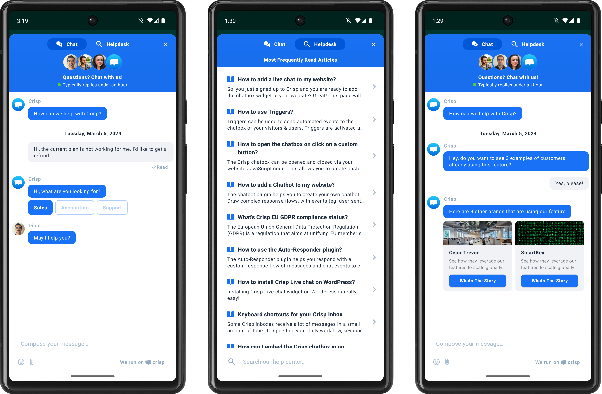
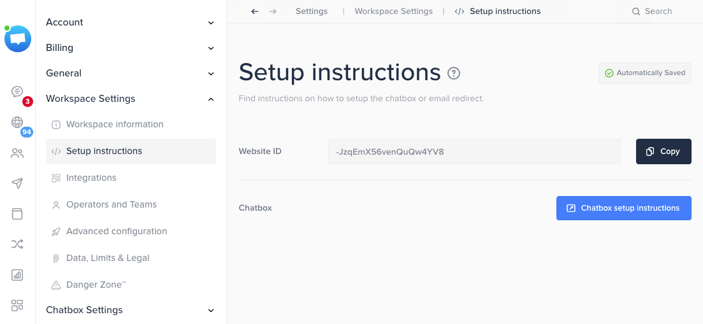

Crisp is a multichannel customer support software that centralizes more than 10 different channels into one place. Among those, chat support is a prominent channel companies choose to offer real-time customer support.

With Crisp native mobile chat SDK for Android, companies can add a seamless support chat experience to their native mobile app.

The chat widget also comes with help articles, AI chatbot builder and many other features built to help companies improve their customer support experience.

# Crisp Chat SDK for Android



[](https://central.sonatype.com/artifact/im.crisp/crisp-sdk)
[](http://twitter.com/crisp_im)

# How does Crisp Chat SDK for Android work?

Crisp Chat works for both logged in and logged out users as well as users juggling between multiple devices. It’s worth reading the detailed instructions about session continuity.

You can open the chat widget from a button in your mobile app, programmatically when someone does a custom action, or from a persistent button that is available in your mobile app.

When your customers open Crisp Widget, they are presented with a chat widget or a help widget.

From there, your customer can search for help articles or start a conversation. A conversation goes to your inbox inside your Crisp Workspace, and replies in both directions happen in real time.

# What are Crisp Chat SDK features?

Our chat sdk for android comes with a handful set of features that prevents your mobile customers from getting an inconsistent experience between web and mobile.

## Chat color customization that fits with your brand identity

Consistency is vital when creating a powerful brand experience, especially when you switch from one device to another. Using Crisp Chat SDK for Android, you make sure the brand identity that is set is consistent all over your platforms.

## AI Chatbot that fits any brand experience

Crisp Chat SDK doesn’t only come with a live chat software, it embeds an [AI chatbot](https://crisp.chat/en/chatbot/) too. From the web version, companies can craft advanced scenarios that will be triggered upon custom scenarios.

To make sure your chatbot is powerful enough, you can enrich AI models with data sources you own: websites, technical docs, help articles, and much more…

## Help article that lands at the right time

Using Crisp widget, you can display [help articles](https://crisp.chat/en/knowledge/) programmatically, within your mobile app. That makes it very easy for your users to get contextualized support at the moment they need it the most.

Whether it is through a click on a button, following a custom event or after displaying a specific page, you can make sure your customer is always able to access the right knowledge.

## Engage your customers through a modern chat experience

Willing to offer a mobile customer support experience that is delightful? Crisp chat sdk for mobile apps is the software development kit you need for your android app. 

Below are some examples of native message types you can leverage to create an exceptional customer support experience through your mobile app.

## Get to know who you’re chatting with, automatically

Using Crisp chat SDK, you can send customers’ data straight to Crisp. It makes your customer support team much more knowledgeable about who they are facing and how they should engage the conversation.

## Trigger marketing automation campaigns from an action in your mobile app

Crisp SDK for mobile app is not just a chat sdk, it’s a whole customer communication sdk that helps you build an amazing customers’ experience.

Using events, you can push key actions made by your users from the mobile app and trigger emails or chat campaigns to follow-up and engage at key steps of their life cycles.

## And a lot more!

Willing to see what Crisp web chat widget can offer to help to improve customer support? [Click here](https://crisp.chat/en/livechat/) to access a detailed and comprehensive list of features for Crisp chat software.

# How to add a Chat SDK to a mobile app?

## 1. Get your Website ID

Go to your [Crisp Dashboard](https://app.crisp.chat/), and copy your Website ID:



## 2. Add Crisp dependency

Add the Crisp SDK in your dependencies:

```java
dependencies {
    implementation 'im.crisp:crisp-sdk:2.0.0beta1'
}
```

## 3. Setup multidex

Configure your app for multidex:

```java
android {
    defaultConfig {
        multiDexEnabled true
    }
}
dependencies {
    // If you're using AndroidX
    implementation 'androidx.multidex:multidex:2.0.1'
    // If you're not using AndroidX
    implementation 'com.android.support:multidex:1.0.3'
}
```

## 4. Initiate

Initialize the library:

```java
// Replace it with your WEBSITE_ID
// Retrieve it using https://app.crisp.chat/website/[YOUR_WEBSITE_ID]/
Crisp.configure(getApplicationContext(), "7598bf86-9ebb-46bc-8c61-be8929bbf93d");
```

## 5. Include Crisp in your activity

You can for instance start Crisp after a click on a button:

```java
Intent crispIntent = new Intent(this, ChatActivity.class);
startActivity(crispIntent);
```

👉 For more details, please go to the Crisp Developer Hub to [access the documentation on the Android SDK](https://docs.crisp.chat/guides/chatbox-sdks/android-sdk/) or go to our Wiki to see [Available APIs](https://github.com/crisp-im/crisp-sdk-android/wiki/2.-Available-APIs).

# Examples of companies using Crisp Chat Android SDK

- [pony](https://getapony.com),
- [jomo](https://jomo.so),
- [bibit](https://bibit.id/).


# Credits

Crisp Android SDK is owned and maintained by [Crisp IM SAS](https://crisp.chat/en/).<br />
You can chat with us on [crisp](https://crisp.chat) or follow us on Twitter at [Crisp_im](http://twitter.com/crisp_im).

# License

Crisp Android SDK is under Copyright license, see [LICENSE](https://github.com/crisp-im/crisp-sdk-android?tab=License-1-ov-file) for more details.
